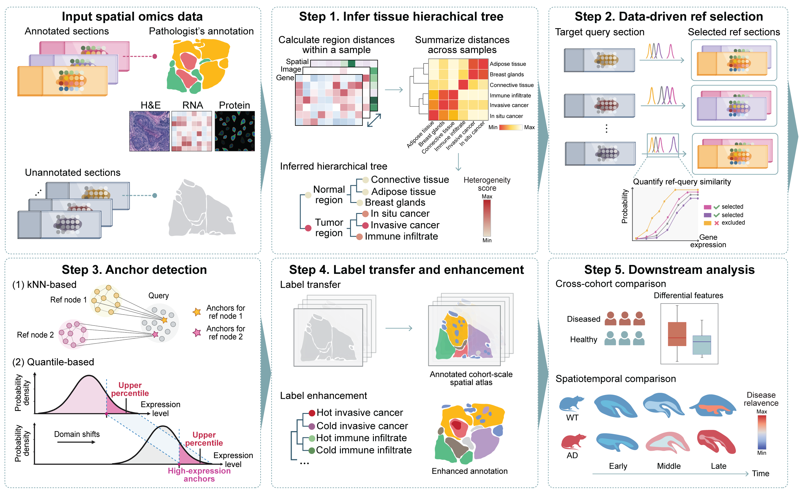

# HiCAT 

## From unsupervised clustering to atlas-guided annotation in cohort-scale spatial omics with HiCAT

#### Jing Huang, Xueqi Shen, Yoland Smith, Lara Harik, Linghua Wang, Jindan Yu, Michael P. Epstein*, Jian Hu*

HiCAT is a supervised computational framework for generating pathologist-informed region annotations and characterizing region-level heterogeneity in multimodal spatial omics data. By generating consistent, enhanced-resolution, and biologically informed region annotations across large cohorts, HiCAT constructs annotated spatial atlas that supports scalable cohort-level downstream analyses, such as identifying tumor subregions associated with clinical outcomes and brain subregions aligned with spatiotemporal disease progression. HiCAT is applicable to diverse spatial omics platforms, including spatial transcriptomics (Spatial Transcriptomics, 10x Visium, 10x Visium HD, and 10x Xenium) as well as paired transcriptomic and protein measurements (10x spatial omics and spatial CITE-seq).

 
For a detailed description of the method and analyses, please see our preprint: [Biorxiv](https://www.biorxiv.org/content/10.64898/2026.05.27.728266v1)
 

## Key features
With [**HiCAT**](https://github.com/jinghuang-stats/HiCAT) package, you can:

- Extract pathologist-generated scribble annotations
- Infer hierarchical tissue organization by integrating multimodal spatial omics inputs
- Quantify region-specific heterogeneity across samples to pinpoint potentially disease-relevant regions for further investigation
- Select suitable reference samples from the training set to provide matched supervision for each query sample
- Transfer pathologist-informed annotations and characterize region-level heterogeneity beyond the granularity of the original annotations
- Perform cohort-level heterogeneity analyses and interpret the functional roles of identified heterogeneous subtypes

## Reference datasets

HiCAT is a supervised framework that requires annotated spatial sections as input. To facilitate direct use, we provide precomputed reference information for breast cancer, human tonsil, and mouse brain, allowing users to perform label transfer and heterogeneity analyses without generating their own annotated reference data.

Users are also welcome to provide their own annotated spatial reference datasets, which can offer more closely matched supervision for label transfer. User-provided references can also be integrated with the provided HiCAT references to support more robust and comprehensive inference. 

## Tutorial
### Step-by-step guides

- [Tutorial Markdown](https://github.com/jinghuang-stats/HiCAT/blob/main/tutorial/tutorial.md)
- [Tutorial Notebook](https://github.com/jinghuang-stats/HiCAT/blob/main/tutorial/tutorial.ipynb)

To open and run the notebook locally, please install Jupyter or use another `.ipynb`-compatible environment such as VS Code.

### Data and reference files

- Toy data: [download here]()
- Precomputated reference information:
  - [breast cancer]()
  - [human tonsil]()
  - [mouse brain]()

## System requirements
HiCAT requies Python and the following core Python packages: 
`numpy`, `pandas`, `scipy`, `scikit-learn`, `scanpy`, `anndata`, `matplotlib`, `seaborn`, `opencv-python`, `Pillow`, `hnswlib`, `slideio`, and `TESLA`.

## Tested software versions

### Environment 1:
- **System:** Mac OS Sonoma 14.0, Apple M1 Pro
- **Python:** 3.11.5
- **Python packages:** `numpy==1.26.2`, `pandas==2.3.0`, `scipy==1.11.4`, `scikit-learn==1.7.0`, `scanpy==1.9.6`, `anndata==0.10.3`, `matplotlib==3.8.2`, `seaborn==0.13.2`, `opencv-python==4.8.1.78`, `Pillow==10.1.0`, `hnswlib==0.8.0`, `slideio==2.4.1`.

## Contributing
The source code is available on GitHub: [HiCAT](https://github.com/jinghuang-stats/HiCAT)

We are actively developing HiCAT and continuing to add new features. Bug reports, feature requests, and suggestions are welcome.

 
